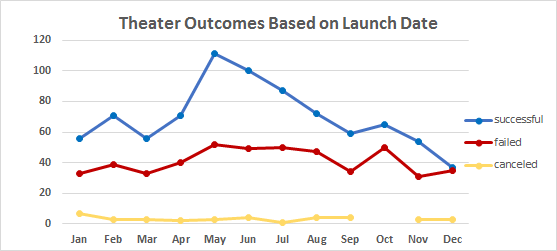
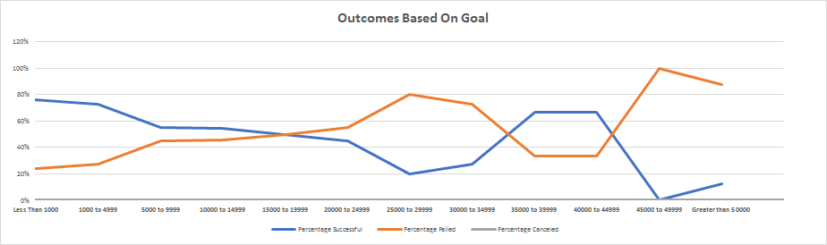

# Kickstarting with Excel

## Overview of Project

### Purpose
The purpose of this assignment is to compare how other similar kickstarter lay campaigns fared to Louise’s failed kickstarter play campaign. Using the data we were able to compare other kickstarter plays launch date and funding goals to find the idea launch time and goal for a kickstarter play. 
## Analysis and Challenges

### Analysis of Outcomes Based on Launch Date
 I performed the analysis by using pivot tables and charts created in the assignment to compare Louise kickstarter campaign ot other kickstarter play campaigns. In the deliverable we looked at outcome by launch date. The data was then filtered to show all kickstarter campaigns with the parent category of theater. Using a pivot table I arranged the data in the pivot table where the months were the row and outcomes were the column. To run an additional analysis I also calculated the percentage of success rates by month.  This let me see by month what percentage of theater campaigns succeeded or failed. 
 This showed me that May was the most popular but also successful month with a 67% success rate which was higher than all other months. Louise started in July which only had a 63% success rate. Also,December was the worst month with only a 49% success rate (the only month below a 50% success rate). January had the most cancelled plays. 
I’d be curious to dive deeper to see if holidays or tax returns impacted the success rate vs failure rate. 
 

### Analysis of Outcomes Based on Goals
 I performed this analysis by using the count if function. This formula showed me the number of kickstarter campaigns by goal amounts. Also included in the count if functions were filteres within the formulas by outcomes and plays.  This gave me the amount of play kickstarter campaigns that succeeded/failed/cancelled by goal ranges. Then I created percentiles to better analyze goal ranges and their success rate. 
  Here I was able to see the most successful campaigns were less than 1k. Goals under 1k had a 76% success rate. Goals between 1k and 5k also had a 73% success rate. The higher the goal the lower the success rate. Louise’s campaign was under 5k but I’d recommend a lower goal for Louise to increase her success chance.   
 

### Challenges and Difficulties Encountered
 In this first deliverable for analysis of outcomes, I struggled with not wanting to continue to breakdown the data. I wanted to look at the data by 2016 and just plays instead of a theater breakdown. I use pivot tables a lot in my current job so I didn’t struggle with the table as much, but more of doing what was asked instead of continuing to break the data down.
 In the second analysis, I struggled some with the count if function. I have never used the count if function and found it a bit tricky and tedious at first. I used > rather than >= on some of the formulas which made my numbers not match up at first. Once I realized this mistake I was able to get the current numbers in the count if function. 
## Results
- What are two conclusions you can draw about the Outcomes based on Launch Date?

 Two things I concluded on outcomes based on launch date was May is the best time to launch a kickerstarter play campaign, whereas December is the worst time, having the most failed campaigns. January had the most cancelled kickstarter campaign concluding that holiday time is the most unsuccessful time to launch a play.  Louise launched her campaign in July, whereas the most successful campagins were launched in May. I’d recommend Louise to launch her kickstarter campaign sooner. 

- What can you conclude about the Outcomes based on Goals

 The most successful projects had a goal lower than $1k with a success rate of 76%. Also, Over ½ of the kickstarter projects had a goal between $1k and $5k with a 73% rate.  Any  campaigns over 50k, 88% of them failed. I can conclude within this data, the lower the campaign the higher the successrate. It’s best to keep goal range for plays below 5k. Louise goal was $2,885 which is within range but still higher than the median goal of plays at $3,000. I’d recommend Louise lowering her goal closer to the 2k range. 

- What are some limitations of this dataset?

 I didn’t feel this was an apples to apples comparison. I would have used just 2016 kickstarter plays campaigns in the US to fully compare Louise’s results to other similar kickstarter play campaigns 

- What are some other possible tables and/or graphs that we could create?

 Some other possible data and graphs to create would be to calculate the average length of campaigns vs the ones that failed to compare to Louise’s campaign. I’d also look at spotlight and staff pick to see if that had an influence on a campaign being successful. Lastly, I’d do a quick statistical measurement as well on plays just in the US to find the median, mean, and look for outliers. 
